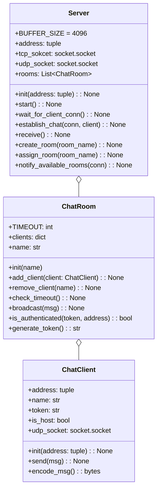
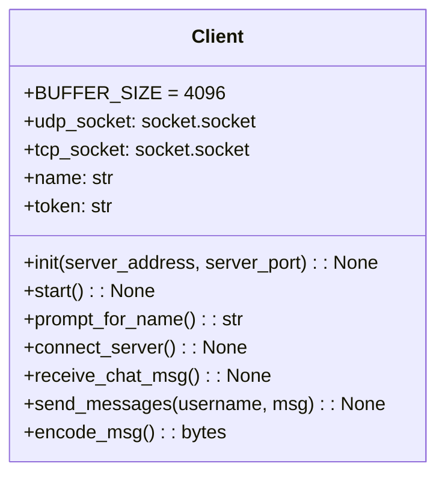

# online-chat-messenger

### Class Diagram
#### Server


##### Server Class
| Property | Description |
| :------: | :------ |
| address | tupleでaddressを受け取る。ソケットを作成する時の引数でもタプルで扱うし、initの引数やプロパティもクラスのプロパティも少なくなるので見通し良くなりそう |
| tcp_socket | クライアントと接続を確立する他確立するためのソケット |
| udp_socket | クライアントとチャットをするために用いるするために用いるソケット|
| rooms | ChatRoomを格納しておくための配列 |

| Method | Description |
| :------: | :------ |
| init | |
| start | サーバーをスタートする。wait_for_client_con, receiveメソッドをそれぞれ別スレッドで呼び出す |
| wait_for_client_con | クライアントのTCP接続をlistenしておく。acceptするたびに、別スレッドでestablish_chatを呼び出す。その時に、acceptの戻り値である、新しく作られたソケットオブジェクトと接続先情報をestablish_chatに渡す。 |
| establish_chat | 引数として受け取ったソケットオブジェクトconnを用いて、クライアントとやり取りする。notify_available_roomsにconnを渡して呼び出し接続可能なルームをクライアントに知らせる。データを受信したのち、ヘッダーのOperationによってcreate_roomかassign_roomを呼び出す。その時にChatClientクラスをインスタンス化してクライアントを作る。状態ごとに、クライアントにレスポンスを送る |
| receive | UDPソケットでクライアントからのメッセージを読み取る。ヘッダのroomNameSize, tokenSizeを読み取って、適切なChatRoomのbroadcastメソッドでメンバーにメッセージを送信する
| create_room | クライアントのリクエストに基づいて、ChatRoomを作成する。Serverのself.roomsに追加する。clientをhostにする |
| assign_room | クライアントのリクエストに基づいて、ChatRoomを割り当てる。self.roomsから対象のルームを探し、そのルームのadd_clientメソッドを介してクライアントを追加する。 |

##### ChatRoom Class
| Property | Description |
| :------: | :------ |
| clients | クライアントをdictで管理する。key=name, value=client ? |
| name | ルームの名前。 |

| Method | Description |
| :------: | :------ |
| add_client | クライアントを追加する。クライアントのnameが重複しないようにする。 |
| remove_client | クライアントを削除する。ホストを削除する場合には、ルームも解散する。 |
| generate_token | クライアントに対してトークンを生成する。secretsライブラリを使用する。 |
| check_timeout | それぞれのクライアントについてタイムアウトを確認する。 |
| notify_disconnection | タイムアウトしたクライアントにその旨を通知する |
| broadcast | 送信者以外にメッセージを送信する。is_authenticatedメソッドでtokenを検証する |
| is_authenticated | 引数のtokenとaddressの組み合わせを持つクライアントを検索する |

##### ChatClient Class
| Property | Description |
| :------: | :------ |
| address | クライアントのaddress。tupleで受け取る |
| name | クライアントの名前 |
| token | token |
| is_host | ホストか否か|
| udp_socket | クライアントにメッセージを送信するためのソケット |

| Method | Description |
| :------: | :------ |
| init | addressのtupleを受け取る |
| send | self.udp_socketのsendtoメソッドを使い、self.addressに対してメッセージを送信する |
| encode_msg | msgをエンコードする |

#### Client


##### Client Class
| Property | Description |
| :------: | :------ |
| tcp_socket | 接続を確立するためのソケット |
| udp_socket | チャットのためのソケット |
| name | name |
| token | token |

| Method | Description |
| :------: | :------ |
| init | サーバのaddressをtupleで受け取る |
| start | connect_serverを呼び出す。 |
| prompt_for_name | nameの入力を促す |
| connect_server | TCPでサーバに接続し、ルーム作成、参加のリクエストを行う |
| join_room | roomNameの入力を受け付ける。リクエストを送り、サーバのレスポンスを待つ。正常にルームの作成、参加が行えたら、receive_chat_msgを別スレッドで呼び出す。同時にsendを呼び出す |
| receive_chat_msg | self.udp_socketでメッセージを受信する |
| send | udp_socketでメッセージをルームに送信する |

### Protocol
#### Client Request
```json
// op 1 (create room), op 2 (join room)
  // サーバの初期化（0）
  {
    "roomName": "example"
    "username": "example"
  }
```
#### Server Response
```json
// op 1 (create room), op 2 (join room)
  // リクエストの応答（1）
  {
    "status": 202,
    "message": "example message"
  }

  // リクエストの完了（2）
  {
    "status": 201,
    "message": "example message"
  }
```