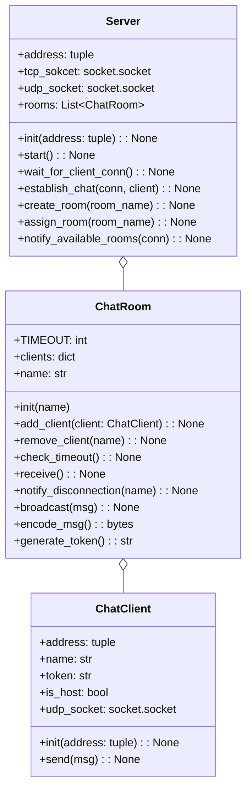
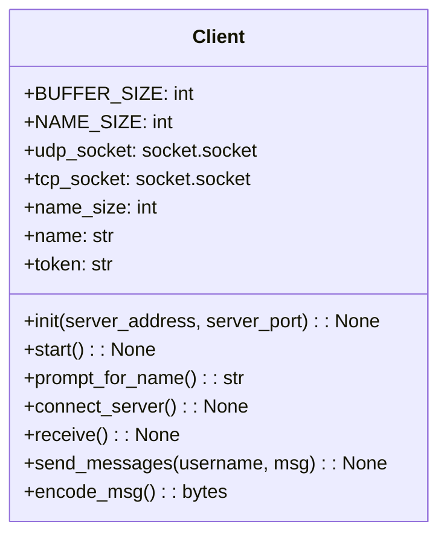

# online-chat-messenger

#### Stage 2

#### Server
##### Server Class
| Property | Description |
| :------: | :------ |
| address | tupleでaddressを受け取る。ソケットを作成する時の引数でもタプルで扱うし、initの引数やプロパティもクラスのプロパティも少なくなるので見通し良くなりそう |
| tcp_socket | クライアントと接続を確立する他確立するためのソケット |
| udp_socket | クライアントとチャットをするために用いるするために用いるソケット|
| rooms | ChatRoomを格納しておくための配列 |

| Method | Description |
| :------: | :------ |
| init | |
| start | サーバーをスタートする。wait_for_client_conメソッドを別スレッドで呼び出す |
| wait_for_client_con | クライアントのTCP接続をlistenしておく。acceptするたびに、別スレッドでestablish_chatを呼び出す。その時に、acceptの戻り値である、新しく作られたソケットオブジェクトと接続先情報をestablish_chatに渡す。 |
| establish_chat | 引数として受け取ったソケットオブジェクトconnを用いて、クライアントとやり取りする。notify_available_roomsにconnを渡して呼び出し接続可能なルームをクライアントに知らせる。データを受信したのち、ヘッダーのOperationによってcreate_roomかassign_roomを呼び出す。その時にChatClientクラスをインスタンス化してクライアントを作る。 |
| create_room | クライアントのリクエストに基づいて、ChatRoomを作成する。Serverのself.roomsに追加する |
| assign_room | クライアントのリクエストに基づいて、ChatRoomを割り当てる。self.roomsから対象のルームを探し、そのルームのadd_clientメソッドを介してクライアントを追加する。 |
| notify_available_rooms | 接続可能なルームの一覧をTCP接続で送信する。引数connで受け取ったソケットオブジェクトを使用する |

##### ChatRoom Class
| Property | Description |
| :------: | :------ |
| TIMEOUT | TIMEOUTの時間。 |
| clients | クライアントをdictで管理する。key=name, value=client ? |
| name | ルームの名前。 |

| Method | Description |
| :------: | :------ |
| add_client | クライアントを追加する。クライアントのnameが重複しないようにする。 |
| remove_client | クライアントを削除する。ホストを削除する場合には、ルームも解散する。 |
| generate_token | クライアントに対してトークンを生成する。secretsライブラリを使用する。 |
| check_timeout | それぞれのクライアントについてタイムアウトを確認する。 |
#### Client
