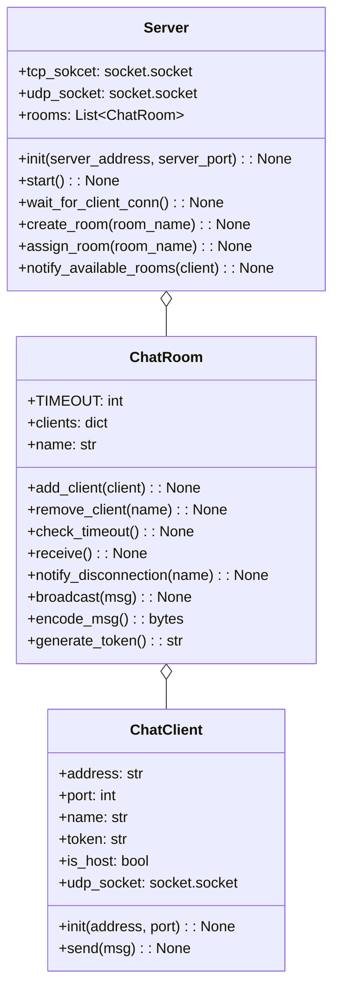
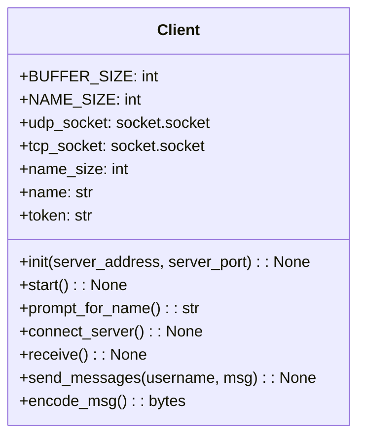

# online-chat-messenger

#### Stage 2

```mermaid
classDiagram
class ChatClient {
  +address: str
  +port: int
  +name: str
  +token: str
  +is_host: bool
  +udp_socket: socket.socket

  +init(address, port): None
  +send(msg): None
}

class ChatRoom {
  +TIMEOUT: int
  +clients: dict
  +name: str

  +add_client(client): None
  +remove_client(name): None
  +check_timeout(): None
  +receive(): None
  +notify_disconnection(name): None
  +broadcast(msg): None
  +encode_msg(): bytes
  +generate_token(): str
}

class Server {
  +tcp_sokcet: socket.socket
  +udp_socket: socket.socket
  +rooms: List~ChatRoom~

  +init(server_address, server_port): None
  +start(): None
  +wait_for_client_conn(): None
  +create_room(room_name): None
  +assign_room(room_name): None
  +notify_available_rooms(client): None
}
Server o-- ChatRoom
ChatRoom o-- ChatClient
```

```mermaid
classDiagram
class Client {
  +BUFFER_SIZE: int
  +NAME_SIZE: int
  +udp_socket: socket.socket
  +tcp_socket: socket.socket
  +name_size: int
  +name: str
  +token: str

  +init(server_address, server_port): None
  +start(): None
  +prompt_for_name(): str
  +connect_server(): None
  +receive(): None
  +send_messages(username, msg): None
  +encode_msg(): bytes
}
```
