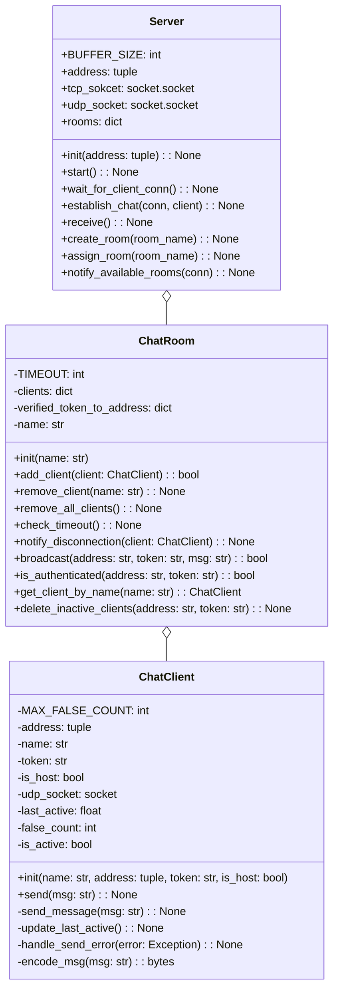
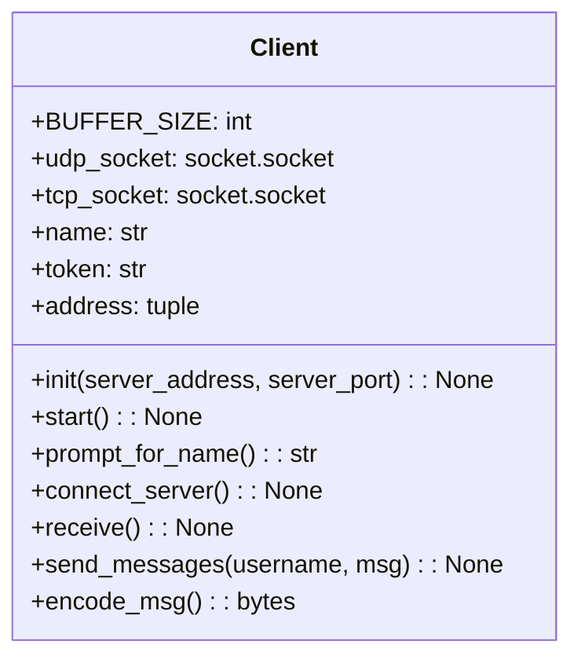

# online-chat-messenger

### Class Diagram

#### Server



##### Server Class

|  Property  | Description                                                                                                                                              |
| :--------: | :------------------------------------------------------------------------------------------------------------------------------------------------------- |
|  address   | tuple で address を受け取る。ソケットを作成する時の引数でもタプルで扱うし、init の引数やプロパティもクラスのプロパティも少なくなるので見通し良くなりそう |
| tcp_socket | クライアントと接続を確立する他確立するためのソケット                                                                                                     |
| udp_socket | クライアントとチャットをするために用いるするために用いるソケット                                                                                         |
|   rooms    | ChatRoom を格納しておくための dict key=roomName, value=ChatRoom                                                                                          |

|       Method        | Description                                                                                                                                                                                                                                                                                                                                                                          |
| :-----------------: | :----------------------------------------------------------------------------------------------------------------------------------------------------------------------------------------------------------------------------------------------------------------------------------------------------------------------------------------------------------------------------------- |
|        init         |                                                                                                                                                                                                                                                                                                                                                                                      |
|        start        | サーバーをスタートする。wait_for_client_con, receive メソッドをそれぞれ別スレッドで呼び出す                                                                                                                                                                                                                                                                                          |
| wait_for_client_con | クライアントの TCP 接続を listen しておく。accept するたびに、別スレッドで establish_chat を呼び出す。その時に、accept の戻り値である、新しく作られたソケットオブジェクトと接続先情報を establish_chat に渡す。                                                                                                                                                                      |
|   establish_chat    | 引数として受け取ったソケットオブジェクト conn を用いて、クライアントとやり取りする。notify_available_rooms に conn を渡して呼び出し接続可能なルームをクライアントに知らせる。データを受信したのち、ヘッダーの Operation によって create_room か assign_room を呼び出す。その時に ChatClient クラスをインスタンス化してクライアントを作る。状態ごとに、クライアントにレスポンスを送る |
|       receive       | UDP ソケットでクライアントからのメッセージを読み取る。ヘッダの roomNameSize, tokenSize を読み取って、適切な ChatRoom の broadcast メソッドでメンバーにメッセージを送信する                                                                                                                                                                                                           |
|     create_room     | クライアントのリクエストに基づいて、ChatRoom を作成する。Server の self.rooms に追加する。client を host にする                                                                                                                                                                                                                                                                      |
|     assign_room     | クライアントのリクエストに基づいて、ChatRoom を割り当てる。self.rooms から対象のルームを探し、そのルームの add_client メソッドを介してクライアントを追加する。                                                                                                                                                                                                                       |

##### ChatRoom Class

| Property | Description                                                  |
| :------: | :----------------------------------------------------------- |
| clients  | クライアントを dict で管理する。key=name, value=ChatClient ? |
|   name   | ルームの名前。                                               |

|        Method        | Description                                                                    |
| :------------------: | :----------------------------------------------------------------------------- |
|      add_client      | クライアントを追加する。クライアントの name が重複しないようにする。           |
|    remove_client     | クライアントを削除する。ホストを削除する場合には、ルームも解散する。           |
|    generate_token    | クライアントに対してトークンを生成する。secrets ライブラリを使用する。         |
|    check_timeout     | それぞれのクライアントについてタイムアウトを確認する。                         |
| notify_disconnection | タイムアウトしたクライアントにその旨を通知する                                 |
|      broadcast       | 送信者以外にメッセージを送信する。is_authenticated メソッドで token を検証する |
|   is_authenticated   | 引数の token と address の組み合わせを持つクライアントを検索する               |

##### ChatClient Class

|  Property  | Description                                      |
| :--------: | :----------------------------------------------- |
|  address   | クライアントの address。tuple で受け取る         |
|    name    | クライアントの名前                               |
|   token    | token                                            |
|  is_host   | ホストか否か                                     |
| udp_socket | クライアントにメッセージを送信するためのソケット |

|   Method   | Description                                                                         |
| :--------: | :---------------------------------------------------------------------------------- |
|    init    | address の tuple を受け取る                                                         |
|    send    | self.udp_socket の sendto メソッドを使い、self.address に対してメッセージを送信する |
| encode_msg | msg をエンコードする                                                                |

#### Client



##### Client Class

|  Property  | Description                  |
| :--------: | :--------------------------- |
| tcp_socket | 接続を確立するためのソケット |
| udp_socket | チャットのためのソケット     |
|    name    | name                         |
|   token    | token                        |
|  address   | address                      |

|     Method      | Description                                                                                                                                                                                     |
| :-------------: | :---------------------------------------------------------------------------------------------------------------------------------------------------------------------------------------------- |
|      init       | サーバの address を tuple で受け取る                                                                                                                                                            |
|      start      | connect_server を呼び出す。                                                                                                                                                                     |
| prompt_for_name | name の入力を促す                                                                                                                                                                               |
| connect_server  | TCP でサーバに接続を行う                                                                                                                                                                        |
|    join_room    | roomName の入力を受け付ける。リクエストを送り、サーバのレスポンスを待つ。正常にルームの作成(op 1)、参加(op 2)完了のレスポンスを受け取る。receive を別スレッドで呼び出す。同時に send を呼び出す |
|     receive     | self.udp_socket でメッセージを受信する                                                                                                                                                          |
|      send       | udp_socket でメッセージをルームに送信する                                                                                                                                                       |

### Protocol

Client request -> Server response (accept) -> Server Shori -> Server response (completed)

#### Client Request

```json
// op 1 (create room), op 2 (join room)
  // サーバの初期化（0）
  {
    "roomName": "example"
    "username": "example"
  }
```

#### Server Response

```json
// op 1 (create room), op 2 (join room)
  // リクエストの応答（1）
  {
    "status": 202,
    "message": "example message"
  }

  // リクエストの完了（2）
  {
    "status": 201,
    "message": "example message"
    "token" "example token"
  }
```
